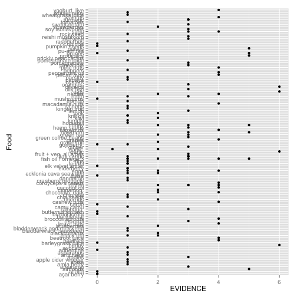

Gamestorm re-analysis of Superfoods data set
================================================

Script to explore, reanalyze and depict Superfoods data.

Originally shown at [http://www.informationisbeautiful.net/visualizations/snake-oil-superfoods/]
and data available [publically](https://docs.google.com/spreadsheet/ccc?key=0Aqe2P9sYhZ2ndHdORGgxdl9xbzJ1enJJNVc5cDFJWXc#gid=2).


```r
# library(RCurl)
library(knitr)
library(ggplot2)
```


Load data.

Method 1. Download from Google Docs (copy of original file in csv format) following this [guide](http://blog.revolutionanalytics.com/2009/09/how-to-use-a-google-spreadsheet-as-data-in-r.html) from our sponsor.

Method 2. Standard read.csv

For both, skip metadata rows then import row 2 as header.                                
                                

```r
# read data skip first 3 rows, then import first row as header
superfoods <- read.csv("Superfood.csv", skip = 3, header = FALSE)
superfoods_header <- read.csv("Superfood.csv", skip = 1, nrow = 1, header = FALSE, 
    stringsAsFactors = FALSE)
colnames(superfoods) <- superfoods_header

# For a challenge, download data from GoogleDocs using RCurl skip first 3
# rows, then import first row as header myCSV <-
# getURL('https://docs.google.com/spreadsheet/pub?key=0Ar5IymziRJ_9dDl1aTdSRlZKakpnNXVjT2ZmVzdaQ1E&single=true&gid=2&output=csv')
# superfoods <- read.csv(textConnection(myCSV), skip = 3, header = FALSE,
# stringsAsFactors = FALSE) dim(superfoods) superfoods_header <-
# read.csv(textConnection(myCSV), nrows = 1, stringsAsFactors = FALSE)
# colnames(superfoods) <- superfoods_header
```


Examine datafile. Subset to relevant colums.


```r
dim(superfoods)
```

```
## [1] 144  38
```

```r
superfoods[1:5, 1:10]
```

```
##         Food alternative name EVIDENCE                   condition
## 1 açaí berry                         0           cancer prevention
## 2 açaí berry                         0              weight control
## 3    alfalfa                         0      general health, cardio
## 4    almonds                         5 cholesterol, general health
## 5   amaranth                         3                cholesterol 
##         HEALTH CONDITION          TYPE One to watch POPULARITY
## 1                 cancer         fruit                    4382
## 2         general health         fruit                    4382
## 3 general health, cardio     vegetable          OTW       3089
## 4 cardio, general health    nut / seed                    3782
## 5                cardio  grain / pulse                    1581
##   NO OF STUDIES WE EXAMINED SCIENTIFIC INTEREST
## 1                         0                  28
## 2                         0                  28
## 3                         0                 152
## 4                        11                 131
## 5                         0                 101
```

```r
superfoods[1:5, 11:20]
```

```
##   UNUSED
## 1       
## 2       
## 3       
## 4       
## 5       
##                                                                                                                                                                        notes
## 1                                                 No human trials. Cell studies show strong anti-oxidant effects - but that's a long way from being "anti-cancer" in humans.
## 2                                                                                Acai berries are widely marketed for weight loss despite no definitive scientific evidence.
## 3                                                                                          Showing some potential, especially for cardiovascular health. No evidence as yet.
## 4                              Almonds consistently lower "bad" (LDL) cholestrol in healthy individuals, and those with high cholesterol and diabetes. (Berryman et al 2011)
## 5 The bulk of the research has been in animal studies.  The Amaranth grain does contain potentially beneficial medicinal compound in varying amounts. Results: inconclusive.
##   Exclude NA
## 1      NA NA
## 2      NA NA
## 3      NA NA
## 4      NA NA
## 5      NA NA
##                                                                                                                                                                                                                                                                                                                                                             notes.1
## 1                                                                                                                                                                                             No human trials, but in vitro studies suggest acai berries exhibit significantly high antioxidant capacity in vitro, and therefore may have possible health benefits.
## 2                                                                                                                                                                                                                                                                                                                                                                  
## 3                                                                                                                                                               2011: Medicago sativa (alfalfa) seems to hold great potential for in-depth investigation for various biological activities, especially their effects on central nervous and cardiovascular system. 
## 4                                Consumption of tree nuts has been shown to reduce low-density lipoprotein cholesterol (LDL-C), a primary target for coronary disease prevention, by 3-19%. Almonds have been found to have a consistent LDL-C-lowering effect in healthy individuals, and in individuals with high cholesterol and diabetes. (Berryman et al 2011)
## 5 2012: Although the great majority of the research about the beneficial functions and actions of amaranth has been conducted in experimental animal models, there are compounds in the grain with potentially beneficial medicinal properties present in the various fractions. 2009: Conclusion: results positive but cannot be attributed to amaranth alone.    
##   Cochrane systematic review Other International review board or metastudy
## 1                                                                         
## 2                                                                         
## 3                              http://www.ncbi.nlm.nih.gov/pubmed/20969516
## 4                              http://www.ncbi.nlm.nih.gov/pubmed/22153059
## 5                                                                         
##                 Link to main individual study
## 1                                            
## 2            http://nccam.nih.gov/health/acai
## 3                                            
## 4   http://www.jacn.org/content/17/3/285.long
## 5 http://www.ncbi.nlm.nih.gov/pubmed/22515252
##   no. of studies in Cochrane metastudy % positive studies / trials
## 1                                   NA                            
## 2                                   NA                            
## 3                                   NA                            
## 4                                   NA                        100%
## 5                                   NA
```

```r

superdata <- superfoods[, c("Food", "alternative name", "EVIDENCE", "condition", 
    "HEALTH CONDITION", "TYPE", "One to watch", "POPULARITY", "NO OF STUDIES WE EXAMINED", 
    "SCIENTIFIC INTEREST")]
str(superdata)
```

```
## 'data.frame':	144 obs. of  10 variables:
##  $ Food                     : Factor w/ 111 levels "açaí berry","alfalfa",..: 1 1 2 3 4 5 6 7 8 9 ...
##  $ alternative name         : Factor w/ 32 levels "","aamla berry, Indian gooseberry, Phyllanthus emblica",..: 1 1 1 1 1 2 30 1 1 1 ...
##  $ EVIDENCE                 : num  0 0 0 5 3 1 1 1 3 1 ...
##  $ condition                : Factor w/ 82 levels "all conditions",..: 15 79 47 27 26 66 68 82 59 39 ...
##  $ HEALTH CONDITION         : Factor w/ 33 levels "cancer","cardio",..: 1 12 16 6 3 18 32 31 12 10 ...
##  $ TYPE                     : Factor w/ 10 levels "alga","animal product",..: 3 3 10 8 5 3 6 9 3 10 ...
##  $ One to watch             : Factor w/ 2 levels "","OTW": 1 1 2 1 1 2 2 1 1 2 ...
##  $ POPULARITY               : Factor w/ 109 levels "1,304","1010",..: 69 69 52 62 25 97 32 43 64 40 ...
##  $ NO OF STUDIES WE EXAMINED: int  0 0 0 11 0 1 1 4 3 1 ...
##  $ SCIENTIFIC INTEREST      : int  28 28 152 131 101 27 160 79 701 171 ...
```


Plot


```r
# base plot
barplot(superdata$EVIDENCE)
```


```r

# point plot
p <- ggplot(superdata, aes(Food, EVIDENCE))
p + geom_point()
```

```
## Warning: conversion failure on 'nattō' in 'mbcsToSbcs': dot substituted for <c5>
## Warning: conversion failure on 'nattō' in 'mbcsToSbcs': dot substituted for <8d>
## Warning: conversion failure on 'nattō' in 'mbcsToSbcs': dot substituted for <c5>
## Warning: conversion failure on 'nattō' in 'mbcsToSbcs': dot substituted for <8d>
## Warning: conversion failure on 'nattō' in 'mbcsToSbcs': dot substituted for <c5>
## Warning: conversion failure on 'nattō' in 'mbcsToSbcs': dot substituted for <8d>
## Warning: conversion failure on 'nattō' in 'mbcsToSbcs': dot substituted for <c5>
## Warning: conversion failure on 'nattō' in 'mbcsToSbcs': dot substituted for <8d>
## Warning: conversion failure on 'nattō' in 'mbcsToSbcs': dot substituted for <c5>
## Warning: conversion failure on 'nattō' in 'mbcsToSbcs': dot substituted for <8d>
```


```r

p <- ggplot(superdata, aes(EVIDENCE, Food))
p + geom_point()
```

```
## Warning: conversion failure on 'nattō' in 'mbcsToSbcs': dot substituted for <c5>
## Warning: conversion failure on 'nattō' in 'mbcsToSbcs': dot substituted for <8d>
## Warning: conversion failure on 'nattō' in 'mbcsToSbcs': dot substituted for <c5>
## Warning: conversion failure on 'nattō' in 'mbcsToSbcs': dot substituted for <8d>
## Warning: conversion failure on 'nattō' in 'mbcsToSbcs': dot substituted for <c5>
## Warning: conversion failure on 'nattō' in 'mbcsToSbcs': dot substituted for <8d>
## Warning: conversion failure on 'nattō' in 'mbcsToSbcs': dot substituted for <c5>
## Warning: conversion failure on 'nattō' in 'mbcsToSbcs': dot substituted for <8d>
## Warning: conversion failure on 'nattō' in 'mbcsToSbcs': dot substituted for <c5>
## Warning: conversion failure on 'nattō' in 'mbcsToSbcs': dot substituted for <8d>
## Warning: conversion failure on 'nattō' in 'mbcsToSbcs': dot substituted for <c5>
## Warning: conversion failure on 'nattō' in 'mbcsToSbcs': dot substituted for <8d>
```




```r
sessionInfo()
```

```
## R version 3.0.1 (2013-05-16)
## Platform: x86_64-apple-darwin10.8.0 (64-bit)
## 
## locale:
## [1] en_US.UTF-8/en_US.UTF-8/en_US.UTF-8/C/en_US.UTF-8/en_US.UTF-8
## 
## attached base packages:
## [1] stats     graphics  grDevices utils     datasets  methods   base     
## 
## other attached packages:
## [1] ggplot2_0.9.3.1 knitr_1.5      
## 
## loaded via a namespace (and not attached):
##  [1] colorspace_1.2-4   dichromat_2.0-0    digest_0.6.3      
##  [4] evaluate_0.5.1     formatR_0.10       grid_3.0.1        
##  [7] gtable_0.1.2       labeling_0.2       MASS_7.3-29       
## [10] munsell_0.4.2      plyr_1.8           proto_0.3-10      
## [13] RColorBrewer_1.0-5 reshape2_1.2.2     scales_0.2.3      
## [16] stringr_0.6.2      tools_3.0.1
```

```r
purl("superfoods_gamestorm.Rmd")
```

```
## 
## 
## processing file: superfoods_gamestorm.Rmd
```

```
## 
  |                                                                       
  |                                                                 |   0%
  |                                                                       
  |......                                                           |   9%
  |                                                                       
  |............                                                     |  18%
  |                                                                       
  |..................                                               |  27%
  |                                                                       
  |........................                                         |  36%
  |                                                                       
  |..............................                                   |  45%
  |                                                                       
  |...................................                              |  55%
  |                                                                       
  |.........................................                        |  64%
  |                                                                       
  |...............................................                  |  73%
  |                                                                       
  |.....................................................            |  82%
  |                                                                       
  |...........................................................      |  91%
  |                                                                       
  |.................................................................| 100%
```

```
## output file: superfoods_gamestorm.R
```

```
## [1] "superfoods_gamestorm.R"
```


